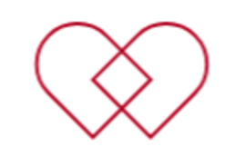

<!-- PROJECT LOGO -->
<br />
<div align="center">
  <a href="https://github.com/sadityakumar9211/medichain-nextjs">
    
  </a>

  <h3 align="center">AI-Enabled Diagnosis with a Decentralized Patient Medical Records</h3>

</div>

## About The Project


**Blockchain** is an immutable ledger and with its decentralized nature has great potential for increasing the security, privacy, and efficiency of Medical Health Record keeping systems. Currently, existing solutions rely on centralized databases which are susceptible to Ransomware attacks, Denial of Service(DoS) attacks and also have significant counterparty risks. Some decentralized solutions also exist but some of them are not really decentralized that is based on private or permissioned blockchain. In contrast, some which are based on public blockchains have not properly addressed the performance and scalability issues.

The proposed system is based on EVM-compatible public blockchains using IPFS as a decentralized file storage solution and uses 2048 bit RSA encryption to encrypt the IPFS HASH of file metadata on the client-side before uploading the HASH on the blockchain. For supporting fast and complex queries this system uses a decentralized indexing protocol The Graph. The smart contract is currently deployed on Skale, Optimism, Polygon zkEVM, Mantle and Gnosis Chain. 

With this system, patients can access their medical records anytime anywhere without the counterparty risk from the centralized entity. This system also features QR code for sharing medical files from patients to doctors. With the proposed implementation the decentralized medical record system provides increased security and privacy compared to centralized systems without loss of significant performance or scalability benefits. 

An AI Module that serves as medical assistance when you have symptoms that you cannot get to the hospital was also implemented using the OpenAI system.

### The links to other repositories of this project is at the top


### Built With

The following is a list of major frameworks, library and tools used for developing this repository.

- [![Next][next.js]][next-url]
- [![React][react.js]][react-url]
- [![tailwindcss][tailwindcss]][tailwind-url]
- [![moralis][moralis]][moralis-url]
- [![web3uikit][web3uikit]][web3uikit-url]
- [OpenAI][https://platform.openai.com/account/api-keys]
- [TheGraph][https://thegraph.com/]

### Blockchains deployed
- Mantle - 
- Scroll - 
- Gnosis Chain - 
- Polygon zkEVM - 
- Optimism -


<!-- GETTING STARTED -->

# Getting Started
<https://bafkreicz7rkns5nalldsbv6qu5l5gtqkjoj72j6ospzfx7voo6p63lf7s4.ipfs.nftstorage.link/>

## Requirements

- [git](https://git-scm.com/book/en/v2/Getting-Started-Installing-Git)
  - You'll know you did it right if you can run `git --version` and you see a response like `git version x.x.x`
- [Nodejs](https://nodejs.org/en/)
  - You'll know you've installed nodejs right if you can run:
    - `node --version` and get an ouput like: `vx.x.x`
- [Yarn](https://classic.yarnpkg.com/lang/en/docs/install/) instead of `npm`
  - You'll know you've installed yarn right if you can run:
    - `yarn --version` and get an output like: `x.x.x`
    - You might need to install it with `npm`
- Optional Instruction
  - Make sure that this repository and `Medikai` repository are in the same level in your directory structure.
  - This makes sure that whenever you deploy the smart contract, this repository's `constants` files are updated.

## Quickstart

```bash
git clone https://github.com/holyaustin/Medikai
cd Medikai
yarn
```

## Locally Deploying

2. Deploy to your contract to Goerli
   After installing dependencies, deploy your contracts to optimism, Scroll, Gnosis or Polygon zkEVM:

```bash
yarn hardhat deploy --network optimism
```

3. Connecting with Subgraph

You can use the same subgraph temporary URI (as present in the `pages/_app.js`) to query the data.

4. Start your UI
   Make sure that:

In your networkMapping.json you have an entry for `PatientMedicalRecordSystem` on the optmism network.

```bash
yarn dev
```


<!-- CONTRIBUTING -->

## Contributing

Contributions are what make the open source community such an amazing place to learn, inspire, and create. Any contributions you make are **greatly appreciated**.

If you have a suggestion that would make this better, please fork the repo and create a pull request. You can also simply open an issue with the tag "enhancement".
Don't forget to give the project a star! Thanks again!

1. Fork the Project
2. Create your Feature Branch (`git checkout -b feature/AmazingFeature`)
3. Commit your Changes (`git commit -m 'Add some AmazingFeature'`)
4. Push to the Branch (`git push origin feature/AmazingFeature`)
5. Open a Pull Request


<!-- LICENSE -->

## License

Project is distributed under the MIT License.


<!-- CONTACT -->

## Contact


[](https://twitter.com/holyaustin)
[](mailto:holyaustin@yahoo.com)

Project Link: [https://github.com/holyaustin/Medikai](https://github.com/holyaustin/Medikai)


<!-- ACKNOWLEDGMENTS -->

## Acknowledgments

- [Choose an Open Source License](https://choosealicense.com)
- [@apollo/client for querying subgraph](https://www.npmjs.com/package/@apollo/client)
- [daisyui plugin for tailwindcss](https://daisyui.com/)
- [ipfs-core](https://www.npmjs.com/package/ipfs-core)
- [node-rsa for encryption](https://www.npmjs.com/package/node-rsa)
- [qrcode for generating qrcode](https://www.npmjs.com/package/qrcode)
- [swr](https://www.npmjs.com/package/swr)


<!-- MARKDOWN LINKS & IMAGES -->
<!-- https://www.markdownguide.org/basic-syntax/#reference-style-links -->


<!-- This is the beginning of the URLs of Badges -->

[next.js]: https://img.shields.io/badge/next.js-000000?style=for-the-badge&logo=nextdotjs&logoColor=white
[next-url]: https://nextjs.org/
[react.js]: https://img.shields.io/badge/React-20232A?style=for-the-badge&logo=react&logoColor=61DAFB
[react-url]: https://reactjs.org/
[tailwindcss]: https://img.shields.io/badge/tailwindcss-62B9F3?style=for-the-badge
[tailwind-url]: https://tailwindcss.com
[moralis]: https://img.shields.io/badge/moralis-7D9DF0?style=for-the-badge&logoColor=6DE9DB
[moralis-url]: https://moralis.io
[web3uikit]: https://img.shields.io/badge/web3uikit-72E6E0?style=for-the-badge&logoColor=6DE9DB
[web3uikit-url]: https://web3ui.github.io/web3uikit/
